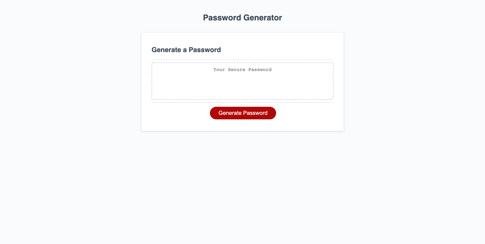

# password-generator

an application that enables employees ti generate a random password

## Task

This Challenge requires me to modify starter code to create an application that enables employees to generate random passwords based on criteria that they’ve selected. This app will run in the browser and will feature dynamically updated HTML and CSS powered by JavaScript code that i wrote . It will have a clean and polished, responsive user interface that adapts to multiple screen

### TODO

Criteria for password

- lowercase "abcdefghijklmnopqrstuvwxyz"
- uppercase "ABCDEFGHIJKLMNOPQRSTUVWXYZ"
- numeric "0123456789"
- special characters " !\"#$%&'()\*+,-./:;<=>?@[]^\_`{|}~"

User Journey

User clicks on button
User will be presented with a prompt to enter length of password (10)
User will be presented with a confirm for lowercase (true)
User will be presented with a confirm for uppercase (true)
User will be presented with a confirm for numeric (true)
User will be presented with a confirm for special characters (true)
User will see the password on the page

Rules

- Password length (len >= 8 < 128)
- From all of the confirms options at least one should be true

## Deployed URL

Github repository: [here](https://github.com/awarsame1996/password-generator)
Live URL: [here](https://awarsame1996.github.io/password-generator/)

## Technologies

- HTML
- CSS
- GitHub Pages
- Javascript
- ...more

## Screenshots

### Desktop Viewport

